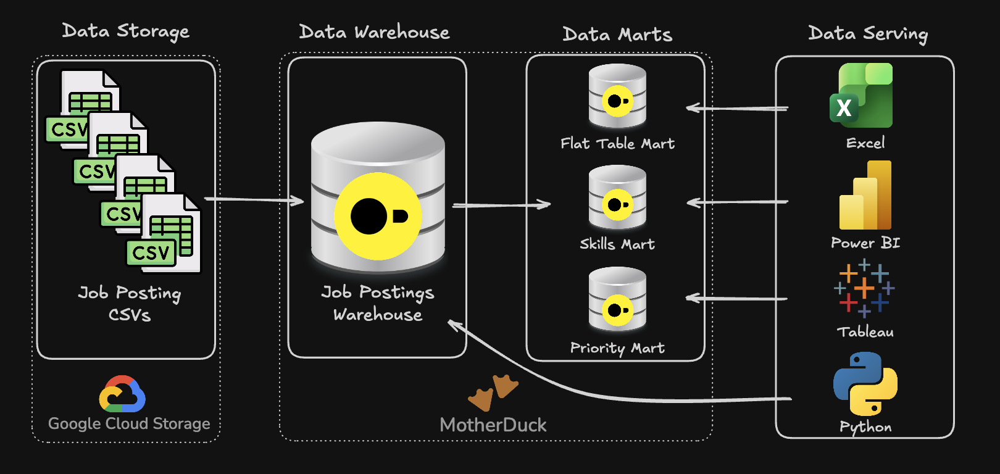

# Data Warehouse & Mart Build: Production ETL Pipeline

An end-to-end SQL data pipeline that transforms raw job-posting CSVs into a production-style data warehouse and downstream data marts, ready for analytics tools to consume.



---

## Executive Summary

This project demonstrates a full, production-style data engineering workflow built entirely with SQL (DuckDB / MotherDuck). It covers:

- **Pipeline Scope** – Ingesting raw job-posting CSVs from Google Cloud Storage and turning them into a governed, queryable data warehouse.
- **Data Modeling** – Designing a star-schema warehouse (fact + dimension tables) with correct primary/foreign key relationships and grain.
- **ETL Development** – Building idempotent SQL scripts to create, load, and transform data through defined stages.
- **Data Mart Architecture** – Serving two purpose-built marts on top of the warehouse:
  - **Flat Mart** – A denormalized, analyst-friendly table combining job, company, and skill data.
  - **Skills Mart** – A time-series mart for analyzing skill demand trends over time.
  - **Priority Mart** – An incrementally updated mart demonstrating production-grade update patterns.

---

## Problem & Context

**The Challenge**
Raw job-posting data on its own is not analytics-ready. Stakeholders need a single, reliable source of truth that is subject-oriented, non-volatile, integrated, and time-variant — not just a flat set of scraped CSV files.

**The Solution**
This project builds an end-to-end pipeline that:

1. Extracts raw job-posting data from source CSV files.
2. Loads and models it into a structured data warehouse (fact and dimension tables).
3. Transforms the warehouse into purpose-built marts (flat, skills, priority) so different consumers — analysts, BI tools, stakeholders — can query the data in the shape that best fits their need.

---

## Tech Stack

| Component | Tool / Language |
|---|---|
| Database engine | DuckDB |
| Cloud data warehouse platform | MotherDuck |
| Schema design | SQL – DDL (`CREATE TABLE`, `DROP TABLE`) |
| Data loading & transformation | SQL – DML (`INSERT`, `UPDATE`, `MERGE`) |
| Pipeline orchestration | `build_marts.sql` master script |
| Source file storage | Google Cloud Storage (source CSV files) |
| Version control | Git & GitHub |

---

## Repository Structure

```text
DW_Mart_Build/
├── 01_create_tables_dw.sql        # Star schema DDL (fact + dimension tables)
├── 02_load_schema_dw.sql          # Data extraction & loading into warehouse tables
├── 03_create_flat_mart.sql        # Denormalized flat mart
├── 04_create_skills_mart.sql      # Skills demand mart
├── 05_create_priority_mart.sql    # Priority mart (initial build)
├── 06_update_priority_mart.sql    # Priority mart incremental update
├── build_marts.sql                # Master build script (orchestrates all steps)
├── image.png                      # Pipeline architecture diagram
└── README.md                      # You are here
```

---

## Pipeline Architecture


The pipeline transforms job posting CSVs from Google Cloud Storage into a normalized star-schema data warehouse, then builds analytical data marts. BI tools (Excel, Power BI, Tableau, Python) consume from the marts.

### 1. Data Warehouse

- **Files:** [`01_create_tables_dw.sql`](./01_create_tables_dw.sql), [`02_load_schema_dw.sql`](./02_load_schema_dw.sql)
- **Tables:** `company_dim`, `skill_dim`, `job_posting_fact`, `skill_job_dim`
- **Purpose:** Star schema serving as the single source of truth. `job_posting_fact` holds one row per job posting with foreign keys to `company_dim`; `skill_job_dim` is a bridge table resolving the many-to-many relationship between jobs and skills.
- **Grain:** One row per job posting in the fact table.

### 2. Flat Mart

- **File:** [`03_create_flat_mart.sql`](./03_create_flat_mart.sql)
- **Purpose:** Denormalized table combining job, company, and skill data for quick, join-free querying.
- **Grain:** One row per job posting with all relevant dimension attributes flattened in.

### 3. Skills Mart

- **File:** [`04_create_skills_mart.sql`](./04_create_skills_mart.sql)
- **Purpose:** Time-series analysis of skill demand over time, with pre-aggregated measures.
- **Grain:** One row per skill per time period.

### 4. Priority Mart

- **Files:** [`05_create_priority_mart.sql`](./05_create_priority_mart.sql) (initial build), [`06_update_priority_mart.sql`](./06_update_priority_mart.sql) (incremental update)
- **Purpose:** Tracks priority job postings, with incremental/batch update logic instead of a full rebuild each time.
- **Grain:** One row per prioritized job posting record.

---

## Data Engineering Skills Demonstrated

**ETL Pipeline Development**
- Designed and built full Extract → Load → Transform SQL scripts.
- Implemented incremental updates so the priority mart can refresh without a full reprocessing.
- Orchestrated the entire build using a master SQL script (`build_marts.sql`), run end-to-end from the terminal.

**Dimensional Modeling**
- Designed a star schema with clearly defined fact (`job_posting_fact`) and dimension (`company_dim`, `skill_dim`) tables.
- Applied primary keys, foreign keys, and a composite-key bridge table (`skill_job_dim`) to resolve the many-to-many relationship between jobs and skills.

**Advanced SQL Techniques**
- DDL: `CREATE TABLE`, `DROP TABLE` for schema and table management.
- DML: `INSERT`, `UPDATE` for data loading and maintenance.
- Joins applied deliberately based on the analytical need across facts, dimensions, and marts.

**Data Quality & Production Practices**
- Wrote idempotent scripts using `DROP TABLE IF EXISTS` so re-running the pipeline doesn't create duplicate or corrupted data.
- Enforced referential integrity between the fact table and its dimensions via foreign keys.
- Enforced data type consistency (`INT`, `VARCHAR`, `BOOLEAN`, `TIMESTAMP`, `DOUBLE`) across the warehouse and marts.
- Documented and version-controlled all changes via Git.

---

## How to Run This Project

1. Clone this repository.
2. Make sure DuckDB (a version compatible with MotherDuck) is installed.
3. From inside the `DW_Mart_Build` folder, run the master build script:

   ```bash
   duckdb dw_marts.duckdb -c ".read build_marts.sql"
   ```

4. Explore the resulting warehouse and marts in the DuckDB CLI, `duckdb -ui`, or by connecting a BI tool.

---

## Tools

SQL | DuckDB | MotherDuck | Git | GitHub
